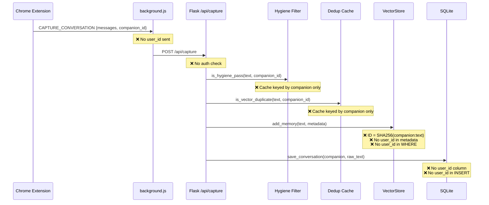
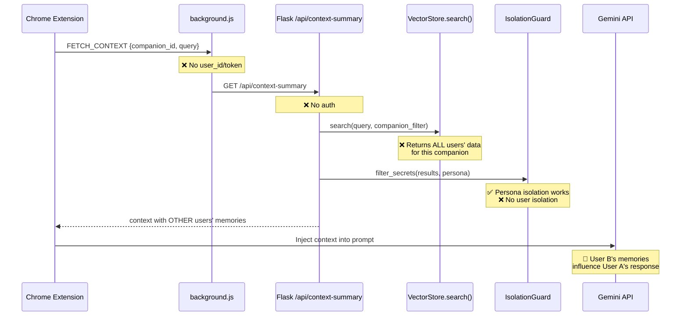
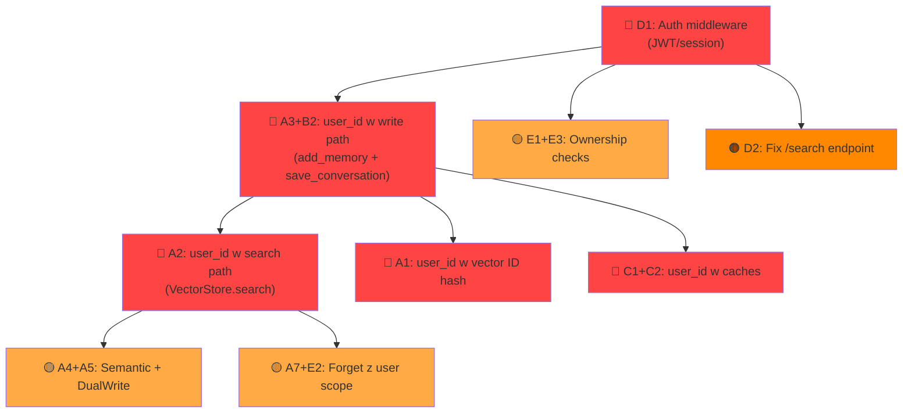

# 🔒 Deep Security Audit: Multi-User Data Isolation

> **Scope**: Cały backend (12 modułów, 2193+ linii [database.py](file:///c:/Users/lpisk/Projects/ucho-VPS/backend/database.py), 1698 linii [app.py](file:///c:/Users/lpisk/Projects/ucho-VPS/backend/app.py), 895 linii [vector_store.py](file:///c:/Users/lpisk/Projects/ucho-VPS/backend/vector_store.py)) + Chrome Extension (3 pliki) + SQLite schema (15 tabel)
>
> **Wynik**: **30+ podatności** w 6 powierzchniach ataku

---

## Spis treści

1. [Architektura — End-to-End Flow](#1-architektura--end-to-end-flow)
2. [Powierzchnia A: Vector Store (ChromaDB)](#powierzchnia-a-vector-store-chromadb)
3. [Powierzchnia B: SQLite Schema](#powierzchnia-b-sqlite-schema)
4. [Powierzchnia C: In-Memory Caches](#powierzchnia-c-in-memory-caches)
5. [Powierzchnia D: API Endpoints](#powierzchnia-d-api-endpoints)
6. [Powierzchnia E: Deletion & IDOR](#powierzchnia-e-deletion--idor)
7. [Powierzchnia F: Infrastruktura](#powierzchnia-f-infrastruktura)
8. [Extension (Client-Side)](#extension-client-side)
9. [Dependency Graph — Kolejność fixów](#dependency-graph--kolejność-fixów)
10. [Migracja istniejących danych](#migracja-istniejących-danych)
11. [P0 Fix Code](#p0-fix-code)

---

## 1. Architektura — End-to-End Flow

### Write Path (Extension → Backend → Storage)



### Read Path (Extension → Backend → Gemini)



> [!CAUTION]
> **Attack scenario**: User A pisze Amelii o rozwodzie. User B pyta Amelię "co wiesz o mnie?" → RAG zwraca wspomnienia User A o rozwodzie → Gemini odpowiada User B cytując intymne detale User A.

---

## Powierzchnia A: Vector Store (ChromaDB)

### A1. 🔴 P0 — Vector ID collision

| | |
|---|---|
| **Plik** | [vector_store.py](file:///c:/Users/lpisk/Projects/ucho-VPS/backend/vector_store.py#L47) |
| **Linia** | `mem_id = hashlib.sha256(f"{companion}:{text}")` |
| **Attack** | User A i B wysyłają "cześć" → identyczny ID → `upsert` nadpisuje |
| **Impact** | Data loss + data leak |

### A2. 🔴 P0 — Search bez user filtru

| | |
|---|---|
| **Plik** | [vector_store.py](file:///c:/Users/lpisk/Projects/ucho-VPS/backend/vector_store.py#L426-L441) |
| **Linia** | `where_clause = {"companion": companion_filter}` |
| **Attack** | [search("pizza", "amelia")](file:///c:/Users/lpisk/Projects/ucho-VPS/backend/vector_store.py#393-532) → zwraca wektory ALL userów z Amelia |
| **Impact** | Full data leak |

### A3. 🔴 P0 — add_memory bez user_id w metadata

| | |
|---|---|
| **Plik** | [app.py](file:///c:/Users/lpisk/Projects/ucho-VPS/backend/app.py#L838-L850) |
| **Linie** | L838, L864, L977, L1661 (4 wywołania [add_memory()](file:///c:/Users/lpisk/Projects/ucho-VPS/backend/dual_write.py#72-108)) |
| **Attack** | Wektory zapisane bez `user_id` → search z `user_id` filtrem je pomija LUB (gorzej) dostępne dla każdego |
| **Impact** | Data orphaning lub data leak |

### A4. 🟡 P1 — Semantic Pipeline save bez user_id

| | |
|---|---|
| **Plik** | [semantic_pipeline.py](file:///c:/Users/lpisk/Projects/ucho-VPS/backend/semantic_pipeline.py#L168-L230) |
| **Linia** | [save_processed()](file:///c:/Users/lpisk/Projects/ucho-VPS/backend/semantic_pipeline.py#168-231) → [add_memory()](file:///c:/Users/lpisk/Projects/ucho-VPS/backend/dual_write.py#72-108) bez `user_id` w metadata |
| **Impact** | Enriched entities (daty, milestones, shared things) dostępne cross-user |

### A5. 🟡 P1 — DualWrite bez user_id passthrough

| | |
|---|---|
| **Plik** | [dual_write.py](file:///c:/Users/lpisk/Projects/ucho-VPS/backend/dual_write.py#L30-L50) |
| **Linia** | [__init__(self, sqlite_db, vector_store, companion_id)](file:///c:/Users/lpisk/Projects/ucho-VPS/backend/memory_extractor.py#17-44) — brak `user_id` |
| **Impact** | `SafeMemoryWriter.write_user_message()` nie może przekazać user_id |

### A6. 🟡 P1 — get_stats / get_milestones bez user scope

| | |
|---|---|
| **Plik** | [vector_store.py](file:///c:/Users/lpisk/Projects/ucho-VPS/backend/vector_store.py) |
| **Funkcje** | [get_stats(companion)](file:///c:/Users/lpisk/Projects/ucho-VPS/backend/vector_store.py#737-756), [get_milestones(companion_filter)](file:///c:/Users/lpisk/Projects/ucho-VPS/backend/database.py#1664-1689) |
| **Impact** | Zwracają aggregate stats ALL userów |

### A7. 🟡 P1 — forget_memory bez user scope

| | |
|---|---|
| **Plik** | [vector_store.py](file:///c:/Users/lpisk/Projects/ucho-VPS/backend/vector_store.py) |
| **Funkcja** | [forget_memory({'query': ..., 'companion': ...})](file:///c:/Users/lpisk/Projects/ucho-VPS/backend/vector_store.py#666-736) |
| **Impact** | User A może usunąć wspomnienia User B |

---

## Powierzchnia B: SQLite Schema

### B1. 🔴 P0 — Żadna tabela nie ma kolumny `user_id`

[database.py](file:///c:/Users/lpisk/Projects/ucho-VPS/backend/database.py#L29-L386) definiuje 15 tabel:

| Tabela | UNIQUE constraint | Brak `user_id` = problem |
|--------|-------------------|--------------------------|
| [conversations](file:///c:/Users/lpisk/Projects/ucho-VPS/backend/app.py#1484-1514) | brak | User A widzi historię User B |
| `relationship_status` | `UNIQUE(persona)` | **Jeden level globalnie** — User B leveluje persona User A |
| [topics](file:///c:/Users/lpisk/Projects/ucho-VPS/backend/database.py#563-576) | FK → conversations | Inherited |
| [emotions](file:///c:/Users/lpisk/Projects/ucho-VPS/backend/database.py#577-590) | FK → conversations | Inherited |
| [facts](file:///c:/Users/lpisk/Projects/ucho-VPS/backend/database.py#591-604) | FK → conversations | Inherited |
| [goals](file:///c:/Users/lpisk/Projects/ucho-VPS/backend/memory_extractor.py#271-314) | brak | User A modyfikuje cele User B |
| [user_state](file:///c:/Users/lpisk/Projects/ucho-VPS/backend/app.py#1303-1346) | `UNIQUE(timestamp)` | **Kolizja** — User A i B w tej samej sekundzie → INSERT fail |
| `companion_configs` | `UNIQUE(companion_name)` | Shared — OK jeśli globalne, ale personalizacja impossible |
| `relationship_metrics` | `UNIQUE(companion, week_start)` | Metryki alle userów zmiksowane |
| [inside_jokes](file:///c:/Users/lpisk/Projects/ucho-VPS/backend/database.py#1111-1166) | `UNIQUE(companion, trigger_phrase)` | User B nadpisuje joke User A |
| `joke_occurrences` | FK → inside_jokes | Inherited |
| [anniversaries](file:///c:/Users/lpisk/Projects/ucho-VPS/backend/database.py#1414-1439) | `UNIQUE(companion, name)` | User B nadpisuje rocznicę User A |
| [shared_things](file:///c:/Users/lpisk/Projects/ucho-VPS/backend/database.py#1519-1558) | `UNIQUE(companion, thing_type, name)` | Cross-user overwrite |
| `persona_secrets` | `UNIQUE(companion, persona, content)` | Sekrety współdzielone |
| [personality_lenses](file:///c:/Users/lpisk/Projects/ucho-VPS/backend/database.py#2165-2181) | `UNIQUE(persona)` | Globalne — OK |
| [milestones](file:///c:/Users/lpisk/Projects/ucho-VPS/backend/database.py#1664-1689) | brak | Cross-user mixing |

> [!WARNING]
> **Najgorszy case**: `relationship_status` ma `UNIQUE(persona)`. Globalnie istnieje **JEDEN** rekord "Amelia". Gdy User A rozmawia → jego XP rośnie. User B rozmawia → ten sam rekord się updateuje. Obaj widzą ten sam level.

### B2. 🔴 P0 — [save_conversation()](file:///c:/Users/lpisk/Projects/ucho-VPS/backend/database.py#441-460) bez user_id

| | |
|---|---|
| **Plik** | [database.py](file:///c:/Users/lpisk/Projects/ucho-VPS/backend/database.py#L441-L459) |
| **SQL** | `INSERT INTO conversations (companion, timestamp, raw_text, ...)` |
| **Fix** | `ALTER TABLE conversations ADD COLUMN user_id TEXT` + dodaj do INSERT |

### B3. 🔴 P0 — [update_relationship()](file:///c:/Users/lpisk/Projects/ucho-VPS/backend/database.py#756-809) bez user_id

| | |
|---|---|
| **Plik** | [database.py](file:///c:/Users/lpisk/Projects/ucho-VPS/backend/database.py#L756-L808) |
| **SQL** | `WHERE persona = ?` — ten sam persona record dla ALL userów |
| **Fix** | `UNIQUE(persona, user_id)` + `WHERE persona = ? AND user_id = ?` |

### B4. 🟡 P1 — Hardcoded seed data z "Łukasz"

| | |
|---|---|
| **Plik** | [database.py](file:///c:/Users/lpisk/Projects/ucho-VPS/backend/database.py#L282-L336) |
| **Problem** | `'Cyfrowa partnerka Łukasza'`, `'Wspierać jego wizję'` — seed data jest per-Łukasz |
| **Fix na MVP** | OK — seed data to default, nowi userzy dostaną generyczną wersję |

---

## Powierzchnia C: In-Memory Caches

### C1. 🔴 P0 — `_dedup_ttl_cache` bez user_id

| | |
|---|---|
| **Plik** | [app.py](file:///c:/Users/lpisk/Projects/ucho-VPS/backend/app.py#L74-L95) |
| **Klucz** | `SHA256(companion_id:text)` |
| **Attack** | User A pisze "dobranoc" → 60s window → User B pisze "dobranoc" → **BLOCKED** |

### C2. 🟡 P1 — `_hygiene_recent_hashes` bez user_id

| | |
|---|---|
| **Plik** | [app.py](file:///c:/Users/lpisk/Projects/ucho-VPS/backend/app.py#L101-L229) |
| **Klucz** | `companion_id` → `set()` of MD5 hashes |
| **Attack** | User A pisze wiadomość → hash w cache → User B pisze identyczną → [duplicate](file:///c:/Users/lpisk/Projects/ucho-VPS/backend/app.py#77-96) reject |

### C3. 🟠 P2 — Caches rosną bez limitu per user

| | |
|---|---|
| **Problem** | `_HYGIENE_MAX_CACHE = 500` — globalny limit. 500 userów × 1 wpis = cache pełny |
| **Fix** | Per-user cache z TTL lub Redis |

---

## Powierzchnia D: API Endpoints

### D1. 🔴 P0 — **ZERO auth na ŻADNYM endpoincie**

| | |
|---|---|
| **Plik** | [app.py](file:///c:/Users/lpisk/Projects/ucho-VPS/backend/app.py) |
| **Fakt** | `require_auth` **NIE ISTNIEJE** w kodzie. Było w ARCHITECTURE_V2.md jako plan, nigdy niezaimplementowane. `grep "require_auth" backend/` → 0 wyników |

**Wszystkie 12 endpointów** są publiczne:

| Endpoint | Metoda | Co robi bez auth |
|----------|--------|------------------|
| `/search` | GET | Szuka w CAŁYM ChromaDB (companion_filter=None!) |
| `/api/context-summary` | GET | Zwraca pamięć RAG + relacje + state |
| `/api/capture` | POST | Zapisuje do DB i ChromaDB |
| `/api/export/<companion>` | GET | Eksportuje pełną pamięć |
| `/api/stats` | GET | Level, XP, milestones, jokes |
| `/api/state` | POST | Zapisuje stan biologiczny |
| `/api/health` | GET | Info o systemie |
| `/api/forget` | POST | **USUWA wspomnienia** |
| `/api/conversations` | GET | Lista rozmów |
| `/api/goals/<id>` | PATCH | Modyfikuje cele |
| `/api/chat` | POST | Rozmowa z Gemini + zapis do RAG |
| `/` | GET | OK — info only |

> [!CAUTION]
> Ktokolwiek z IP twojego VPS może: `curl http://yourip:5000/api/forget -d '{"query":"*", "max_to_delete":1000}'` → **wymazuje całą pamięć**.

### D2. 🔴 P0 — `/search` endpoint z `companion_filter=None`

```python
# app.py:379 — DOSŁOWNIE:
hits = vector_memory.search(user_query, companion_filter=None)
```

Szuka **we WSZYSTKIM**. Bez filtra. Bez auth. Publiczny GET.

### D3. 🟡 P1 — `/api/chat` RAG search bez user scope

| | |
|---|---|
| **Plik** | [app.py](file:///c:/Users/lpisk/Projects/ucho-VPS/backend/app.py#L1592-L1602) |
| **Problem** | RAG loop szuka po `companion_filter` ale bez `user_id` |
| **Impact** | /api/chat zwraca odpowiedzi oparte na CUDZYCH wspomnieniach |

### D4. 🟡 P1 — `/api/chat` zapisuje do RAG bez user_id

| | |
|---|---|
| **Plik** | [app.py](file:///c:/Users/lpisk/Projects/ucho-VPS/backend/app.py#L1660-L1669) |
| **Problem** | [add_memory(text, metadata={'companion':...})](file:///c:/Users/lpisk/Projects/ucho-VPS/backend/dual_write.py#72-108) — brak `user_id` |

---

## Powierzchnia E: Deletion & IDOR

### E1. 🟡 P1 — IDOR na `/api/goals/<goal_id>`

| | |
|---|---|
| **Plik** | [app.py](file:///c:/Users/lpisk/Projects/ucho-VPS/backend/app.py#L1518-L1550) |
| **Problem** | `goal_id` = sequential integer. User A może `PATCH /api/goals/42` → modyfikuje cel User B |
| **Fix** | Sprawdź ownership: `WHERE id = ? AND user_id = ?` |

### E2. 🟡 P1 — `/api/forget` bez user scope

| | |
|---|---|
| **Plik** | [app.py](file:///c:/Users/lpisk/Projects/ucho-VPS/backend/app.py#L1429-L1479) |
| **Problem** | [MemoryCleanup(companion_id).forget(query)](file:///c:/Users/lpisk/Projects/ucho-VPS/backend/memory_cleanup.py#24-163) — operuje na WSZYSTKICH danych companion |

### E3. 🟡 P1 — [delete_conversation()](file:///c:/Users/lpisk/Projects/ucho-VPS/backend/database.py#864-906) bez ownership check

| | |
|---|---|
| **Plik** | [database.py](file:///c:/Users/lpisk/Projects/ucho-VPS/backend/database.py#L864-L905) |
| **SQL** | `DELETE FROM conversations WHERE id = ?` — zero sprawdzenia kto jest właścicielem |

### E4. 🟡 P1 — [delete_conversations_by_criteria()](file:///c:/Users/lpisk/Projects/ucho-VPS/backend/database.py#907-994) bez user_id

| | |
|---|---|
| **Plik** | [database.py](file:///c:/Users/lpisk/Projects/ucho-VPS/backend/database.py#L907-L993) |
| **Problem** | `WHERE companion = ? AND summary LIKE ?` — usuwa matching records ALL userów |

---

## Powierzchnia F: Infrastruktura

### F1. 🟠 P2 — CORS: `origins: "*"`

```python
# app.py:33
CORS(app, resources={r"/*": {"origins": "*", ...}})
```

Każda strona w internecie może robić requesty do twojego API.

### F2. 🟠 P2 — HTTP, nie HTTPS

`background.js:5` → `const BACKEND_URL = 'http://localhost:5000'`

OK na localhost, ale na VPS trzeba HTTPS (man-in-the-middle → przechwycenie wspomnień).

### F3. 🟠 P2 — Brak rate limiting

Zero ochrony przed:
- Brute force flooding RAG
- DDoS na Gemini API (twój klucz, twoja kasa)
- Cache poisoning (flood dedup cache)

### F4. 🟠 P2 — `debug=True` w produkcji

```python
# app.py:1697
app.run(debug=True, host='127.0.0.1', port=5000)
```

Debug mode = interactive debugger na błędach. Jeśli host zmieni się na `0.0.0.0` → RCE (Remote Code Execution).

### F5. ⚪ P3 — SQLite threading model

- Zero `threading` imports w całym backend
- Flask dev server = single-threaded (OK na dev)
- Gunicorn z workers > 1 + SQLite = **database locked** errors
- Fix docelowy: PostgreSQL lub connection pooling

### F6. ⚪ P3 — Gemini API key w env (OK)

```python
# chat_engine.py:14
GEMINI_API_KEY = os.getenv('GEMINI_API_KEY')
```

Poprawnie z env, nie z kodu. Ale brak `.env` w repo (sprawdzone) — jest prawdopodobnie na VPS bezpośrednio. OK.

---

## Extension (Client-Side)

### EXT1. 🟠 P2 — Zero auth w requestach

```javascript
// background.js:64
const response = await fetch(`${BACKEND_URL}/api/capture`, {
    method: 'POST',
    headers: { 'Content-Type': 'application/json' },
    body: JSON.stringify(payload)
    // ❌ No Authorization header
    // ❌ No user_id in payload
});
```

**Fix**: Dodaj JWT token do headers i `user_id` do payload.

### EXT2. 🟡 P1 — Ghost Patch w MAIN world

```json
// manifest.json:32
"world": "MAIN"
```

Ghost Patch ma dostęp do JS context strony Gemini. To jest celowe (interceptuje XHR), ale w multi-user: jeśli dwóch userów ma extension na tym samym Chrome profile → conflict.

### EXT3. ⚪ P3 — `BACKEND_URL` hardcoded

```javascript
const BACKEND_URL = 'http://localhost:5000';
```

Na MVP OK (SSH tunnel). Docelowo: konfigurowalne w extension settings.

---

## Dependency Graph — Kolejność fixów

Fixes muszą iść w kolejności zależności. Nie możesz dodać `user_id` do search (A2) zanim nie dodasz go do write (A3).



### Proponowana kolejność (5 faz)

| Faza | Czas | Co | Blokuje |
|------|------|----|---------|
| **Faza 0** | 2h | Auth middleware (JWT) | Wszystko |
| **Faza 1** | 4h | Write path: `user_id` w [add_memory()](file:///c:/Users/lpisk/Projects/ucho-VPS/backend/dual_write.py#72-108) + [save_conversation()](file:///c:/Users/lpisk/Projects/ucho-VPS/backend/database.py#441-460) + SQLite migration | Faza 2 |
| **Faza 2** | 3h | Read path: `user_id` w [search()](file:///c:/Users/lpisk/Projects/ucho-VPS/backend/vector_store.py#393-532) + `context-summary` + RAG | Faza 3 |
| **Faza 3** | 3h | Caches + secondary modules (caches, semantic, dual_write, cleanup) | — |
| **Faza 4** | 2h | IDOR + endpoint hardening + CORS + rate limit | — |

**Total: ~14h** rozłożone na 3-5 dni.

---

## Migracja istniejących danych

> [!IMPORTANT]
> Dane Łukasza (jedynego obecnego usera) nie mają `user_id`. Po fixach stracisz do nich dostęp, chyba że zmigrujesz.

### ChromaDB migration

```python
# migrate_vectors.py — jednorazowy skrypt
from vector_store import VectorStore
import hashlib

vs = VectorStore()
collection = vs.collection

# 1. Get all existing vectors
all_data = collection.get(include=['metadatas', 'documents'])

# 2. Add user_id to metadata
for i, meta in enumerate(all_data['metadatas']):
    meta['user_id'] = 'lukasz'  # Legacy user

# 3. Update in bulk
collection.update(
    ids=all_data['ids'],
    metadatas=all_data['metadatas']
)

# 4. Re-hash IDs (optional — ryzykowne, może spowodować duplikaty)
# Bezpieczniej: nowe wektory dostają nowy format, stare zostają
```

### SQLite migration

```sql
-- Dla KAŻDEJ bazy: ucho_amelia.db, ucho_family.db, etc.
ALTER TABLE conversations ADD COLUMN user_id TEXT DEFAULT 'lukasz';
ALTER TABLE relationship_status ADD COLUMN user_id TEXT DEFAULT 'lukasz';
ALTER TABLE goals ADD COLUMN user_id TEXT DEFAULT 'lukasz';
ALTER TABLE user_state ADD COLUMN user_id TEXT DEFAULT 'lukasz';
ALTER TABLE inside_jokes ADD COLUMN user_id TEXT DEFAULT 'lukasz';
ALTER TABLE anniversaries ADD COLUMN user_id TEXT DEFAULT 'lukasz';
ALTER TABLE shared_things ADD COLUMN user_id TEXT DEFAULT 'lukasz';
ALTER TABLE persona_secrets ADD COLUMN user_id TEXT DEFAULT 'lukasz';

-- Update UNIQUE constraints (SQLite nie zmienia UNIQUE — trzeba recreate)
-- Na MVP: enforceuj w application layer, nie w DB
```

---

## P0 Fix Code

### Fix Auth Middleware (Faza 0)

```python
# backend/auth.py — NOWY PLIK
import jwt
import os
from functools import wraps
from flask import request, jsonify

JWT_SECRET = os.getenv('JWT_SECRET', 'change-me-in-production')

def require_auth(f):
    @wraps(f)
    def decorated(*args, **kwargs):
        token = request.headers.get('Authorization', '').replace('Bearer ', '')
        if not token:
            return jsonify({'error': 'No token provided'}), 401
        try:
            payload = jwt.decode(token, JWT_SECRET, algorithms=['HS256'])
            request.user_id = payload['user_id']
        except jwt.ExpiredSignatureError:
            return jsonify({'error': 'Token expired'}), 401
        except jwt.InvalidTokenError:
            return jsonify({'error': 'Invalid token'}), 401
        return f(*args, **kwargs)
    return decorated

def generate_token(user_id: str) -> str:
    import datetime
    payload = {
        'user_id': user_id,
        'exp': datetime.datetime.utcnow() + datetime.timedelta(days=30)
    }
    return jwt.encode(payload, JWT_SECRET, algorithm='HS256')
```

### Fix VectorStore (Faza 1-2)

Patrz diff w [poprzednim audycie](file:///C:/Users/lpisk/.gemini/antigravity/brain/1c301676-b7a7-44f5-bf05-e0d19c668dd0/security_audit_multi_user.md) — sekcja "Gotowy kod P0 fixów".

### Fix Dedup + Hygiene Caches (Faza 3)

```diff
 # app.py — is_vector_duplicate()
-def is_vector_duplicate(text: str, companion_id: str) -> bool:
+def is_vector_duplicate(text: str, companion_id: str, user_id: str = 'legacy') -> bool:
-    key = hashlib.sha256(f"{companion_id}:{text.strip()[:500]}".encode()).hexdigest()
+    key = hashlib.sha256(f"{user_id}:{companion_id}:{text.strip()[:500]}".encode()).hexdigest()

 # app.py — is_hygiene_pass() + hygiene_register()
-    recent = _hygiene_recent_hashes.get(companion_id, set())
+    cache_key = f"{user_id}:{companion_id}"
+    recent = _hygiene_recent_hashes.get(cache_key, set())
```

---

## Verification Plan

### Istniejące testy

```bash
cd c:\Users\lpisk\Projects\ucho-VPS\backend
python test_privacy.py     # Companion isolation (Amelia ≠ Family)
```

[test_privacy.py](file:///c:/Users/lpisk/Projects/ucho-VPS/backend/test_privacy.py) testuje izolację companion-level (Amelia nie widzi Family). **NIE testuje user-level isolation**. Trzeba rozszerzyć.

### Nowe testy do dodania

```python
# test_user_isolation.py — schemat
def test_vector_id_no_collision():
    """Dwóch userów, ten sam tekst → różne ID."""
    
def test_search_user_isolation():
    """User A nie widzi wektorów User B."""
    
def test_cache_no_cross_blocking():
    """User A's dedup nie blokuje User B."""
    
def test_relationship_per_user():
    """User A's XP nie wpływa na User B."""
    
def test_forget_user_scoped():
    """User A nie może usunąć wspomnień User B."""

def test_idor_goals():
    """User A nie może PATCH goala User B."""
```

### Manual verification

1. Uruchom `python migrate_vectors.py` → sprawdź `collection.get()` → każdy metadata ma `user_id: 'lukasz'`
2. Dodaj wektor jako `user_id='test_user'` → search jako `user_id='lukasz'` → NIE powinien go znaleźć
3. `curl -X POST http://localhost:5000/api/capture -d '{...}'` bez tokena → powinien zwrócić 401
